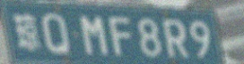
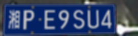
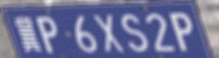
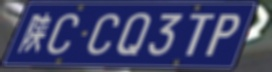
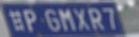
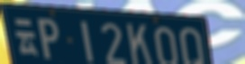
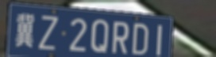
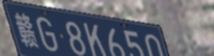

# end-to-end-for-plate-recognition
多标签分类,端到端的中文车牌识别基于mxnet .
从[xlvector的ocr代码](https://github.com/szad670401/learning-dl/tree/master/mxnet/ocr)修改，减少了参数，由于我没有显卡。单线程 9 samples/s 速度 ，用CPU在MBP上跑了50w张样本。识别率到了81%。不过还没有完全收敛。

## 训练好的模型
https://github.com/ibyte2011/end-to-end-for-chinese-plate-recognition

## 关于车牌识别
生成的车牌对于实际车牌并不是效果很好，在结合真实样本和GAN，训练了一个更好的模型，对真实车牌表现很好。
并实现了一整套车牌识别的系统命名为HyperLPR https://github.com/zeusees/HyperLPR

## 依赖:
 + Numpy
 + Mxnet
 + Opencv
 
## 生成的车牌样张
通过渲染车牌加上畸变、噪声、与自然环境结合生成车牌的样本。

 
  
   
    
     
        
    
        
    
     
         
## 识别样张

 

